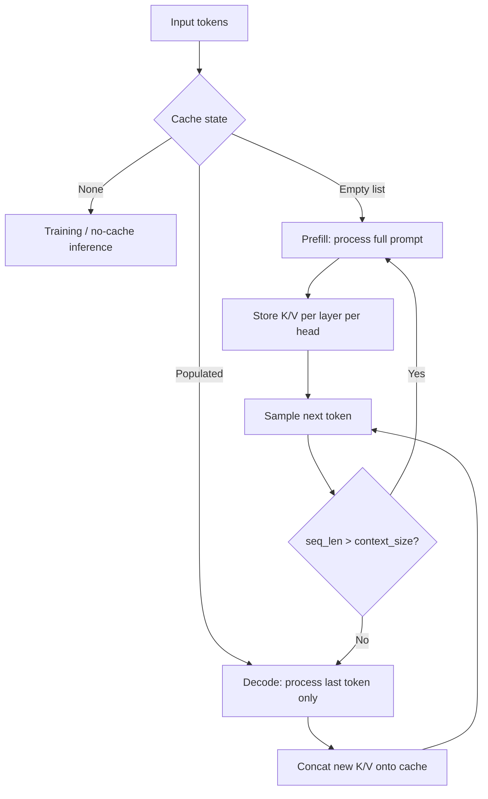

# KV Cache

Implementation notes for incremental inference in TinyGPT.

## Motivation

Without a cache, autoregressive generation re-runs the full attention stack on every new token. For a sequence of length `T`, that is roughly O(T²) work per generated token.

A **KV cache** stores the key and value projections from prior tokens. On each decode step, only the new token is projected to Q/K/V; K and V are appended to the cache, and attention runs over the full cached sequence. Per-token cost drops to O(T) once the prompt is prefilled.

## Cache structure

Defined in `model/kv_cache.py`:

```
KVCache   = list[LayerCache]     # one entry per transformer layer
LayerCache = list[HeadCache]     # one entry per attention head
HeadCache  = (key, value)        # tensors shaped (batch, seq_len, head_size)
```

Each layer holds `num_heads` `(k, v)` pairs. Keys and values are the outputs of the per-head linear projections **after** the input has passed through that layer's LayerNorm (inside the attention submodule).

## Data flow



### Prefill

On the first `generate()` step (or after a sliding-window reset), the model receives the full prompt window:

```python
logits, _, kv_cache = model(
    idx[:, -context_size:],
    kv_cache=[],       # empty list signals "build cache"
    pos_offset=0,
)
```

Every layer computes K/V for all prompt positions and returns the updated cache.

### Decode

On subsequent steps, only the last token is forwarded:

```python
logits, _, kv_cache = model(
    idx[:, [-1]],
    kv_cache=kv_cache,
    pos_offset=idx.size(1) - 1,
)
```

Each attention head concatenates the new K/V onto its cached tensors and attends with a single query position over the full key length.

### Sliding context window

When `idx.size(1) > context_size`, the model truncates to the last `context_size` tokens. Position embeddings are **rebased** to `0 … context_size - 1` for that window, so cached K/V from the previous window would be inconsistent. The cache is discarded and a fresh prefill is run on the truncated window.

## Per-module changes

### `model/attention.py` — `SelfAttention`

- `_attend(q, k, v, q_len)` centralizes the attention math.
- Causal masking is applied only when `q_len == k_len` (full-sequence / prefill path). On decode, `q_len == 1` and all cached keys are valid predecessors, so no mask is needed.
- `forward(x, kv_cache=None, *, use_cache=False)`:
  - `use_cache=False` — training path; returns `out` only.
  - `use_cache=True` — concatenates `kv_cache` onto new K/V if present, returns `(out, (k, v))`.

### `model/multi_head.py` — `MultiHeadAttention`

- `layer_cache is not None` enables the cache path (an empty list `[]` means "no prior K/V, but build cache").
- Each head maintains its own `(k, v)` pair.
- Returns `(out, new_layer_cache)` when caching is active.

### `model/block.py` — `TransformerBlock`

- Passes `layer_cache` into attention only; the feed-forward block always runs on the current token slice.
- Returns `(x, new_layer_cache)` when `layer_cache is not None`.

### `model/embeddings.py` — `GPTEmbedding`

- `pos_offset` sets the absolute position of the first token in `x`.
- During decode, the single new token is embedded at position `idx.size(1) - 1`.

### `model/gpt.py` — `GPT`

- `nn.Sequential` blocks replaced with `nn.ModuleList` so cache state can be threaded per layer.
- `forward(x, targets=None, kv_cache=None, pos_offset=0)`:
  - `kv_cache=None` — unchanged training behavior; returns `(logits, loss)`.
  - `kv_cache` provided (including `[]`) — returns `(logits, loss, new_kv_cache)`.
- `generate(..., use_kv_cache=True)` orchestrates prefill → decode → sliding-window reset.

## API

### `generate()` (default)

```python
generated = model.generate(
    idx,
    max_new_tokens=100,
    temperature=0.8,
    top_k=40,
    use_kv_cache=True,   # default
)
```

`inference.py` uses this path automatically.

### Disable cache (debug / parity checks)

```python
generated = model.generate(idx, max_new_tokens=100, use_kv_cache=False)
```

This restores the original behavior: re-process the full context window on every step.

### Manual cache control

```python
# Prefill
logits, _, cache = model(prompt_ids, kv_cache=[], pos_offset=0)

# Decode one step
logits, _, cache = model(
    next_token_ids,
    kv_cache=cache,
    pos_offset=current_position,
)
```

### Training (unchanged)

```python
logits, loss = model(input_ids, targets)
```

Do not pass `kv_cache` during training.

## Performance characteristics

| Scenario | Cost per new token |
|----------|-------------------|
| No cache | O(context_size) — full forward pass |
| Cache, within window | O(cached_seq_len) — single-token forward + cached attention |
| Cache, window slides | O(context_size) — full re-prefill on that step |

The largest speedup appears when generating many tokens within a single context window (prompt + generation ≤ `context_size`).

## Limitations

- **Learned absolute positions** — sliding the window requires a cache reset because position indices restart at 0. RoPE (on the roadmap) would allow cache trimming without a full re-prefill.
- **No batched decode with variable cache lengths** — the current API assumes batch size 1 during generation.
- **Feed-forward still runs per decode step** — only attention is cached; FFN cost remains O(1) per token regardless.

## Files touched

| File | Role |
|------|------|
| `model/kv_cache.py` | Type aliases for cache structure |
| `model/attention.py` | Per-head K/V caching and conditional causal mask |
| `model/multi_head.py` | Per-head cache threading |
| `model/block.py` | Layer-level cache pass-through |
| `model/embeddings.py` | `pos_offset` for decode positions |
| `model/gpt.py` | Cache-aware `forward` and `generate` |
